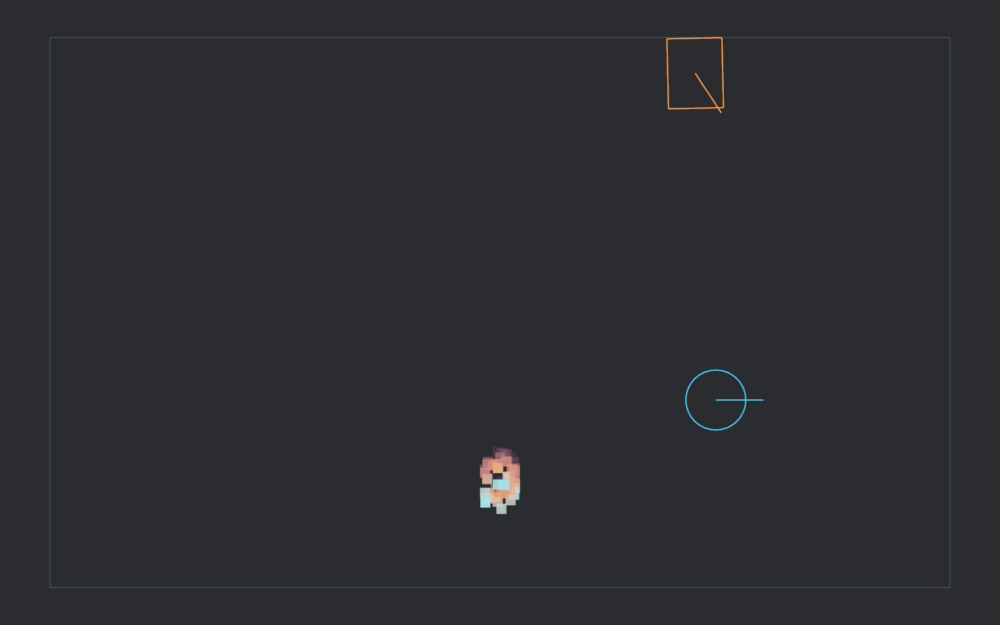
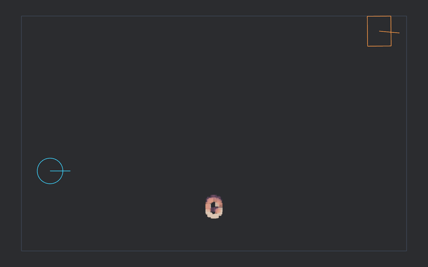

# template-bevy


[](https://bevy.org/)
[](https://www.rust-lang.org/)
[](LICENSE)

A Bevy game starter with Rapier physics. Choose 2D, 3D, or both; add networking,
Blender/Skein assets, MCP inspection, and browser support during generation.
Cargo works independently of Nix.

```sh
cargo install cargo-generate --version 0.25.0 --locked
cargo generate --git https://github.com/sagan-software/template-bevy \
  --name my-game --no-workspace --allow-commands
cd my-game
cargo xtask setup
cargo run -p my-game
```

The generation hook resolves the new project's Cargo lockfile.
Install Rust and native libraries using [Bevy's setup guide](https://bevy.org/learn/quick-start/getting-started/setup/),
or use `nix develop` for the pinned environment.

WASD or arrows move the player; Space boosts movement. Networking mode also
supports the left gamepad stick and south button.




The media shows this template's networked 2D demo. Generated projects receive
starter media and their own README.

[Development and checks](docs/src/development.md) ·
[Architecture](docs/src/architecture.md) ·
[Configuration](docs/src/configuration.md) ·
[Blender assets](docs/src/assets.md) ·
[Dependency compatibility](docs/src/dependencies.md)

Build the public documentation with `cargo xtask book`.
Run this repository's demo with `cargo run -p template-bevy` or `nix run`.
